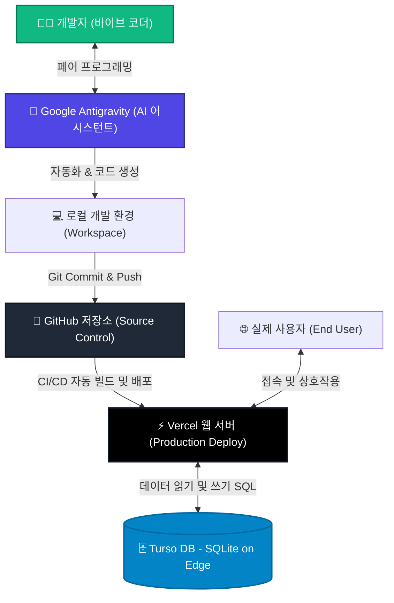

<!-- 이 마크다운 파일은 실무 바이브 코딩 강의의 핵심 도구 및 아키텍처 흐름을 보여주는 강의 개요 문서입니다. -->
# 🚀 실무 바이브 코딩 (Practical Vibe Coding) 강의 개요

현대적인 AI 도구와 강력한 클라우드 서비스를 결합하여, 복잡한 설정 없이 아이디어를 단숨에 완성형 서비스로 구축하는 **실무 바이브 코딩(Practical Vibe Coding)** 과정입니다.

---

## 🛠️ 핵심 도구 생태계 (Tech Stack)

이 강의에서는 복잡한 인프라 설정이나 어려운 설정 파일 작성 없이, 개발 효율성을 극대화하기 위해 다음과 같은 현대적 도구 생태계를 유기적으로 결합하여 사용합니다.

| 도구 | 핵심 역할 | 실무에서의 비유 및 특징 |
| :--- | :--- | :--- |
| **구글 안티그래비티 (Google Antigravity)** | **AI 코딩 어시스턴트** | **"개발의 뇌 & 페어 프로그래머"** 단순 코드 완성을 넘어 프로젝트 전체 컨텍스트를 이해하고, 계획부터 실행까지 주도하는 강력한 개발 동반자입니다. |
| **깃허브 (GitHub)** | **소스 코드 버전 관리** | **"코드 안전 보관소 & 협업 허브"** 구글 드라이브처럼 소중한 코드를 실시간으로 백업하고, 버전 관리 및 Vercel과의 연동을 위한 브릿지 역할을 합니다. |
| **터쏘 (Turso)** | **서버리스 SQLite 데이터베이스** | **"초경량 글로벌 데이터 저장소"** 설정이 복잡한 기존 DB와 달리, SQLite 기반으로 가볍고 빠르게 동작하며 전 세계 엣지 환경에 복제되는 강력한 데이터베이스입니다. |
| **버셀 (Vercel)** | **글로벌 호스팅 & 배포 플랫폼** | **"웹 서버 구동 및 도메인 자동 연결"** 코드 클릭 몇 번으로 전 세계 사용자에게 1초 만에 로딩되는 초고속 웹 서비스를 제공하고 도메인을 연결해 줍니다. |

---

## 📊 서비스 아키텍처 & 개발 흐름 (Architecture Flow)

우리가 실습을 통해 구축하게 될 현대적인 웹 애플리케이션의 유기적인 연동 흐름입니다.

---

## 💡 바이브 코딩이 만들어내는 강력한 시너지

1. **생산성의 혁신**: 구글 안티그래비티 AI가 요구사항 정의부터 코드 구현, 버그 수정까지 전 과정을 보조하여 개발 속도가 10배 이상 향상됩니다.
2. **배포 스트레스 제로**: Vercel과 GitHub의 자동 연동(CI/CD) 덕분에 코드 저장소에 Push하는 것만으로 빌드부터 배포, 도메인 반영까지 알아서 처리됩니다.
3. **지속 가능한 데이터 관리**: Turso DB를 활용하여 서버리스 환경에서도 응답 속도가 빠르고 관리가 편리한 현대적 데이터 아키텍처를 손쉽게 운용할 수 있습니다.
