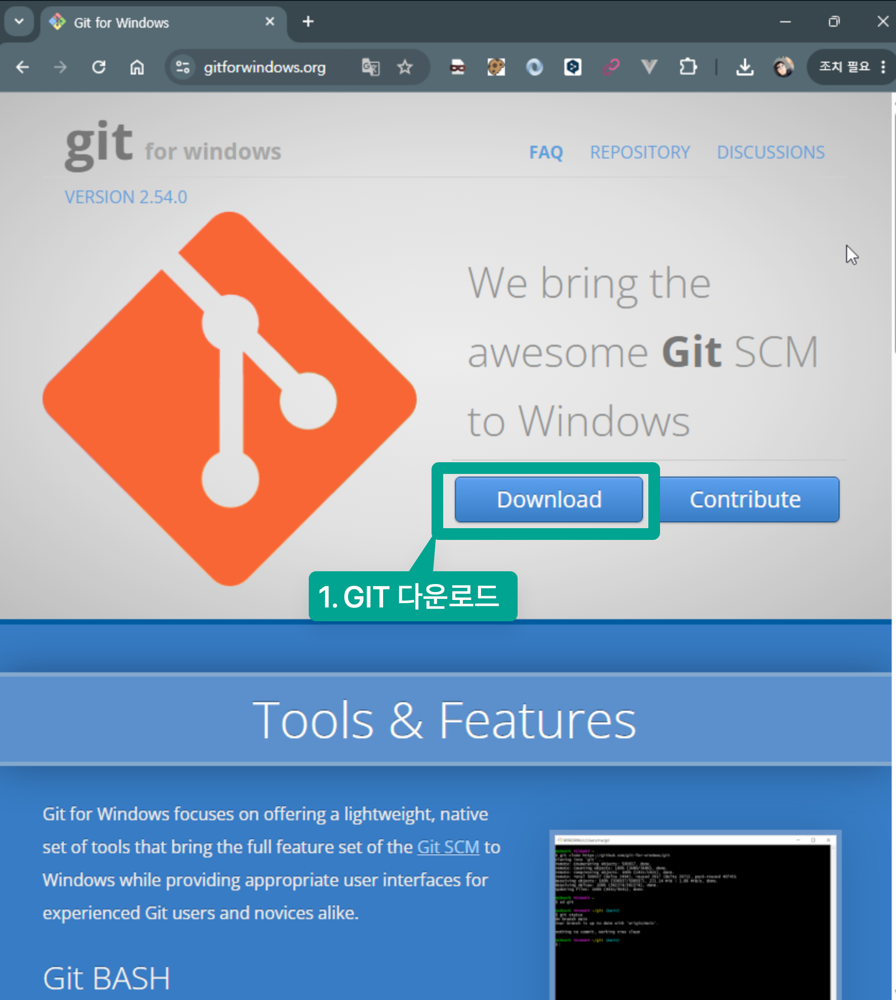
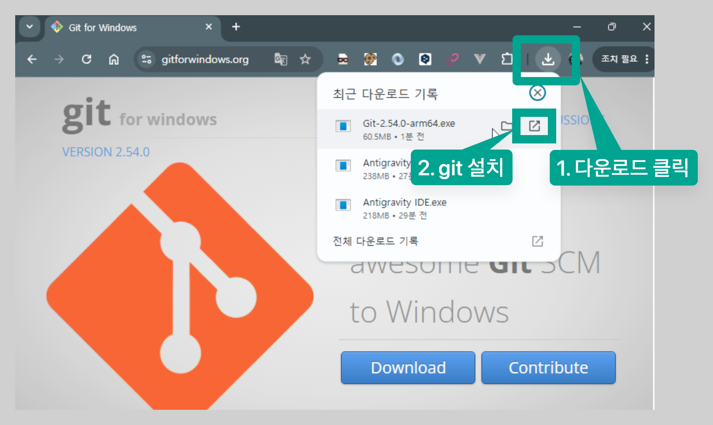
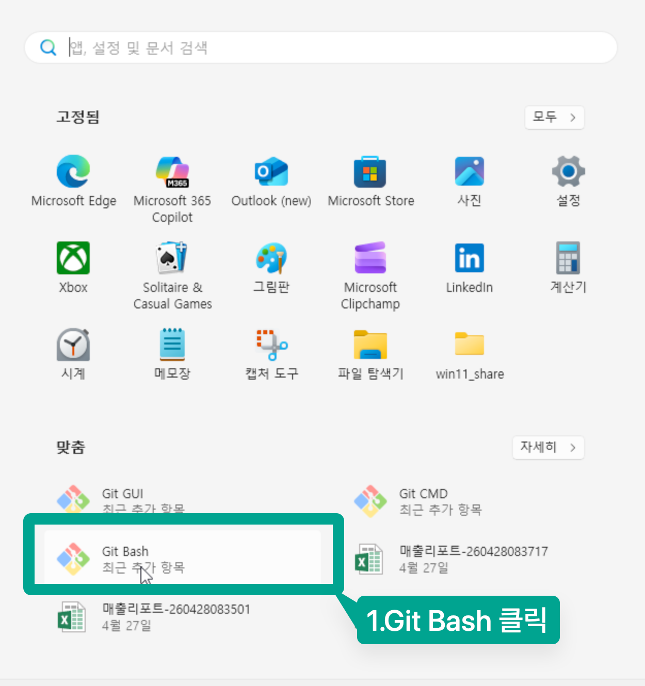
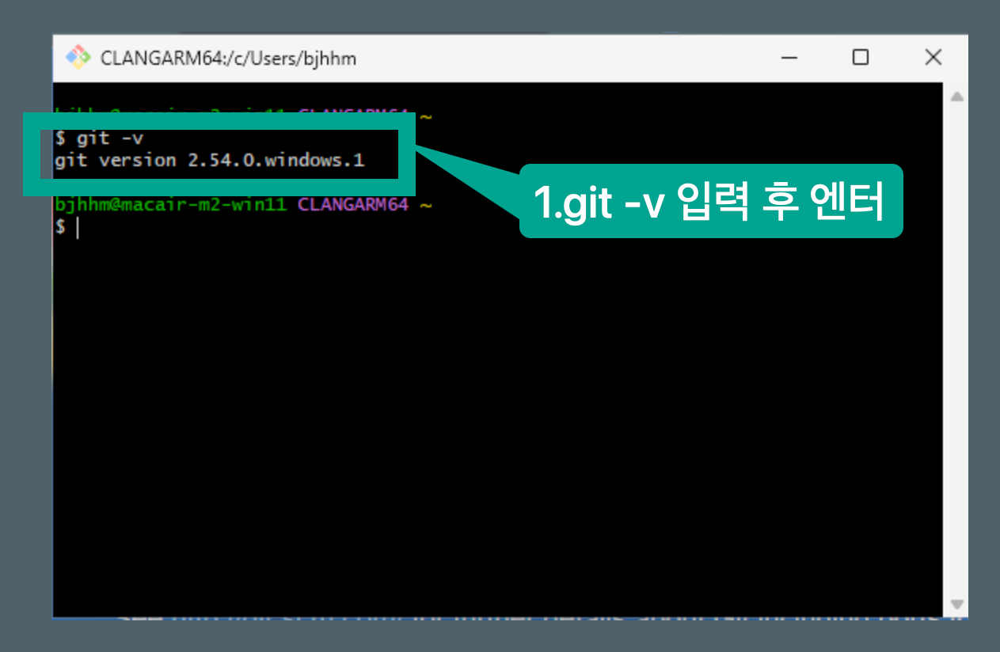

<!-- 이 문서는 강의 시작 전 수강생이 준비해야 할 개발 환경(Google Antigravity, Git, GitHub, Turso, Vercel)을 OS(윈도우/맥)별로 가이드합니다. -->
# Practical Vibe Coding Course - 수강생 사전 준비사항

본 강의는 인공지능 기반의 코드 생성 및 협업 도구를 활용하는 실습 중심의 과정입니다. 원활한 실습 진행을 위해 **강의 시작 전**까지 아래의 준비 사항을 반드시 완료해 주시기 바랍니다.

윈도우(Windows)와 맥(macOS) 사용자 모두를 위해 각각 나누어 기재하였으니, 본인의 운영체제에 맞춰 단계를 따라 진행해 주세요.

---

## 0. 구글 계정 준비
본 강의는 개인 구글 계정 2개 , 회사 구글 계정 1개를 사용하여 진행됩니다.
실습 시 토큰이 부족하면 다른 계정으로 변경하면서 진행할 예정입니다.
### 1. 본인 구글 계정 2개 준비하기
   - 본인 구글 계정1 
   - 본인 구글 계정2 
   
### 2. 본인 회사 구글 계정 1개  
   - 예 : (xxxxxxx@d2.co.kr)
    
---


## 1. Google Antigravity 설치 및 설정

**Google Antigravity**는 Google DeepMind 팀이 개발한 강력한 AI 코딩 에이전트 도구로, 강의 실습 및 페어 프로그래밍 진행을 위한 핵심 어시스턴트입니다.

### [설치 및 실행 단계]
1. **[Google Antigravity 공식 웹사이트](https://antigravity.google/download)**에 접속하여 본인의 운영체제에 맞는 설치 프로그램(또는 익스텐션/바이너리)을 다운로드 후 설치 합니다.
[설치 및 세팅](안티그래비티설치및세팅.md)을 먼저 완료해 주시기 바랍니다.
<!-- 구체적인 Antigravity 바이너리/도구의 구동 방식에 맞춰 공식 링크 정보와 연동하여 세부 설정 내용이 업데이트될 수 있습니다. -->


---

## 2. Git 설치 및 GitHub 가입

### 1) GitHub 회원가입
- 소스 코드 저장소 연동 및 협업을 위해 GitHub 계정이 필요합니다.
- **[GitHub 공식 웹사이트](https://github.com/)**에 접속하여 회원가입을 완료해 주세요. 본인 구글 계정(회사 구글 계정은 가급적 사용하지 말아야 합니다.)으로 가입 후 이메일 인증까지 완료하는 것을 권장합니다.

### 2) Git 설치 및 로컬 설정 (OS별 안내)

#### 🖥️ Windows (윈도우) 사용자
1. **[Git for Windows 공식 사이트](https://gitforwindows.org/)**에 접속하여 최신 버전 설치 프로그램을 다운로드합니다.



2. 기본 설정(Next)으로 설치를 진행하시되, PATH 설정 단계에서 `Git from the command line and also from 3rd-party software`가 선택되었는지 확인합니다.

3. 설치 완료 후 **Git Bash**를 실행하여 정상 작동하는지 확인합니다.


#### 🍎 macOS (맥) 사용자
1. 터미널(Terminal) 앱을 실행합니다. (Command + Space 누르고 `Terminal` 검색)
2. 아래 명령어를 입력하고 엔터를 칩니다.
   ```bash
   git --version
   ```
3. 만약 Git이 설치되어 있지 않다면, Xcode Command Line Tools 설치 여부를 묻는 팝업이 나타납니다. **[설치]** 버튼을 클릭하여 진행해 주세요.
4. (선택 사항) 패키지 매니저인 **Homebrew**가 설치되어 있다면 다음 명령어로도 설치 가능합니다.
   ```bash
   brew install git
   ```

### 3) Git 로컬 계정 등록 (공통)
설치가 끝난 후 터미널(Windows의 경우 Git Bash)을 열어 본인의 GitHub 계정 정보로 로컬 계정을 설정합니다.
```bash
git config --global user.name "본인의 GitHub 이름"
git config --global user.email "본인의 GitHub 가입 이메일"
```

---

## 3. Node.js 및 VS Code 설치

### 1) Node.js 및 npm 설치 (LTS 버전)
- **[Node.js 공식 다운로드 페이지](https://nodejs.org/ko)**에 접속하여 LTS(안정화) 버전을 설치합니다.
- 설치 완료 후 터미널에서 다음 명령어로 버전을 확인하여 설치 상태를 검증합니다.
  ```bash
  node -v
  npm -v
  ```

### 2) Visual Studio Code (VS Code) 설치 (옵션)
- **[VS Code 공식 웹사이트](https://code.visualstudio.com/)**에서 다운로드 및 설치를 진행합니다.
- 실습에 권장되는 VS Code 확장 패키지(Extensions):
  - **Korean Language Pack** (한국어 팩)
  - **Prettier - Code formatter** (자동 코드 정렬 도구)

---

## 4. Turso 클라우드 데이터베이스 가입 및 CLI 설치

**Turso**는 SQLite 기반의 분산 클라우드 데이터베이스 서비스로, 실습용 데이터 보관을 위해 가입과 설치가 필요합니다.

### 1) Turso 회원가입
- **[Turso 공식 웹사이트](https://turso.tech/)**에 접속합니다.
- `Sign Up` 버튼을 누르고, 앞서 생성한 **GitHub 계정으로 로그인(Sign up with GitHub)**하여 간편하게 가입을 완료합니다.

### 2) Turso CLI 설치 (OS별 안내)

#### 🖥️ Windows (윈도우) 사용자
1. PowerShell을 **관리자 권한**으로 실행합니다. (시작 메뉴에서 PowerShell 우클릭 후 '관리자로 실행' 클릭)
2. 아래 명령어를 복사하여 붙여넣고 실행합니다.
   ```powershell
   iex (irm fet.sh/turso)
   ```
3. 설치 완료 후 PowerShell 창을 닫았다가 다시 열어 `turso --version`을 입력해 봅니다.

#### 🍎 macOS (맥) 사용자
1. 터미널을 열고 아래 명령어를 입력하여 Homebrew 탭을 추가하고 Turso CLI를 설치합니다.
   ```bash
   brew install tursodatabase/tap/turso
   ```
2. 설치 완료 후 터미널에 `turso --version`을 입력해 봅니다.

### 3) Turso CLI 로그인 (공통)
CLI 설치가 성공했다면, 터미널창에 아래 명령어를 입력하여 웹 브라우저를 통한 로그인을 완료해 줍니다.
```bash
turso auth login
```

---

## 5. Vercel 클라우드 배포 플랫폼 가입

**Vercel**은 실습 과정에서 제작할 프론트엔드 프로젝트를 빠르게 클라우드 환경에 배포하고 테스트하는 용도로 사용됩니다.

### [가입 및 설정 단계]
1. **[Vercel 공식 웹사이트](https://vercel.com/)**에 접속합니다.
2. `Sign Up`을 클릭한 뒤, **Hobby (무료 개인 계정)** 라이선스를 선택합니다.
3. **Continue with GitHub**을 선택하여 앞서 가입한 GitHub 계정과 완전히 연동해 줍니다. (이를 통해 Git 커밋 시 자동 배포되는 실습이 가능해집니다.)

---

<!-- 수강생 준비 중에 궁금한 점이나 에러가 나면 강의 채널 혹은 조교에게 미리 알려 주세요. -->
## 6. 최종 확인 체크리스트
- [ ] Google Antigravity가 올바르게 작동하거나 설치 준비가 되어 있나요?
- [ ] GitHub 회원가입이 완료되었고 로컬 Git 설정이 되어 있나요?
- [ ] `node -v` 입력 시 버전(18.x 이상)이 정상 출력되나요?
- [ ] Turso 웹 가입 완료 및 CLI 설치가 정상적으로 확인되나요?
- [ ] Vercel 계정이 본인의 GitHub 계정과 연동되어 가입되었나요?
