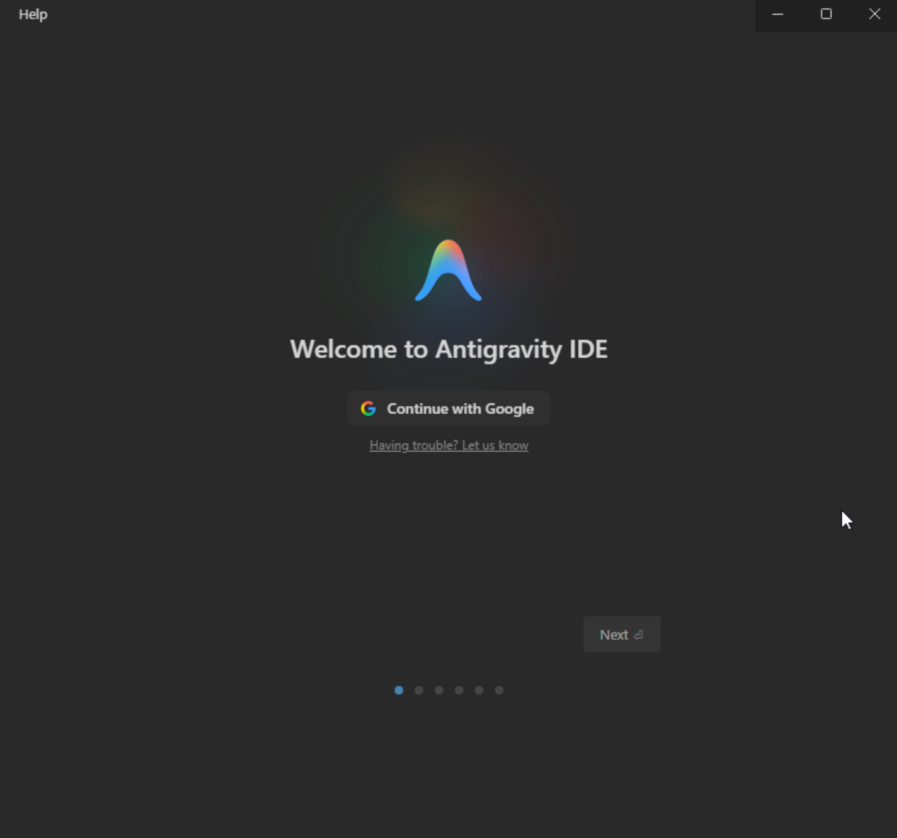
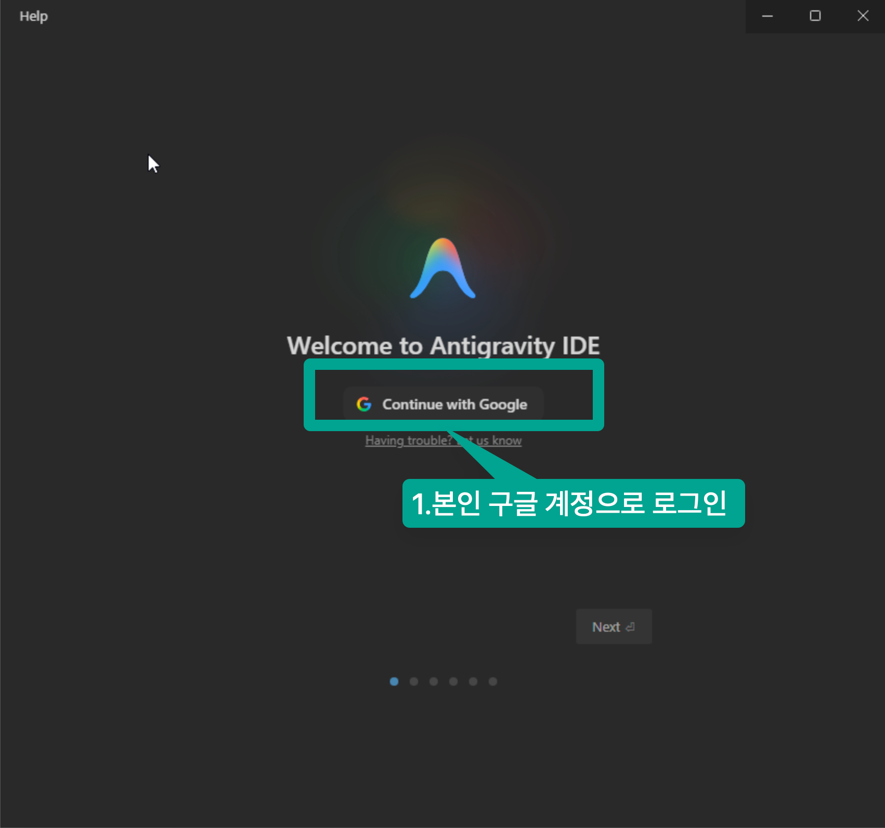
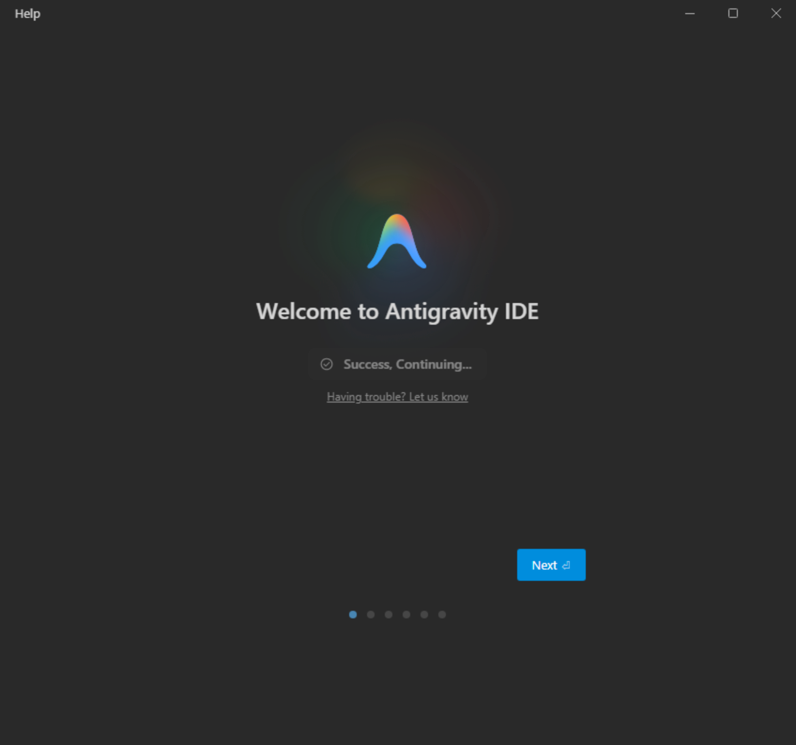
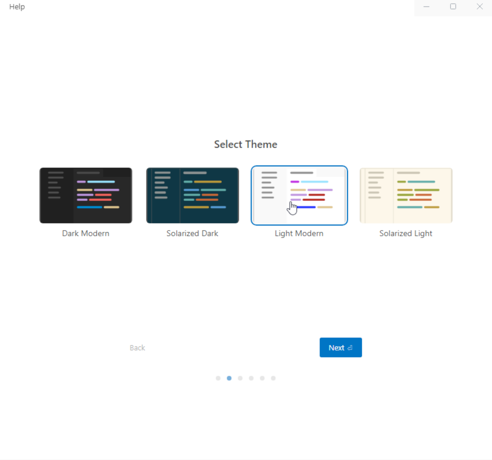
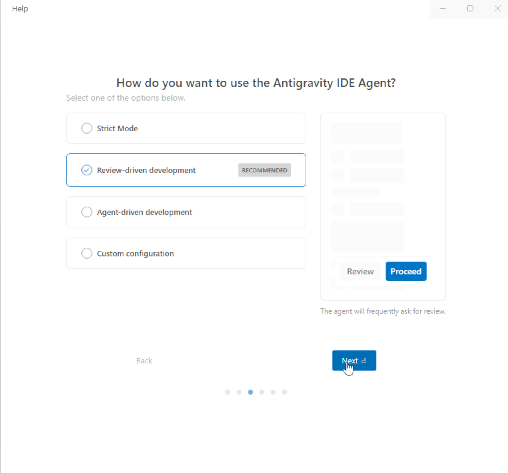
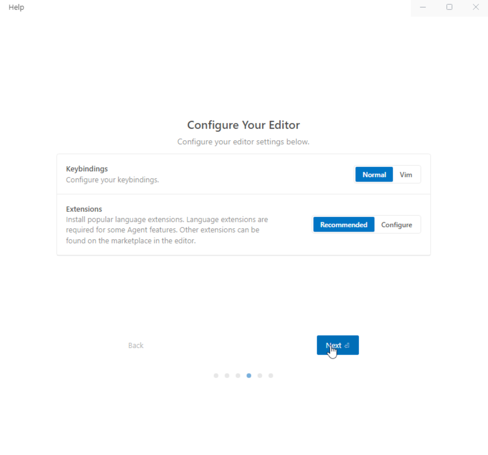
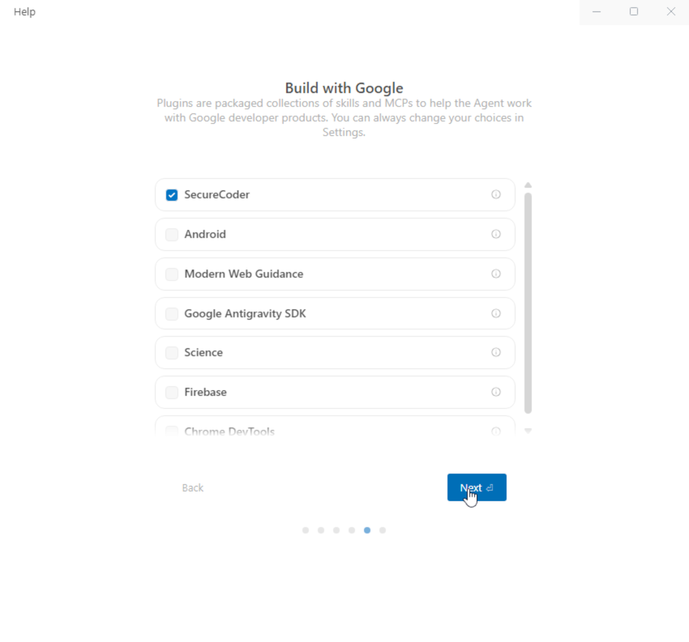
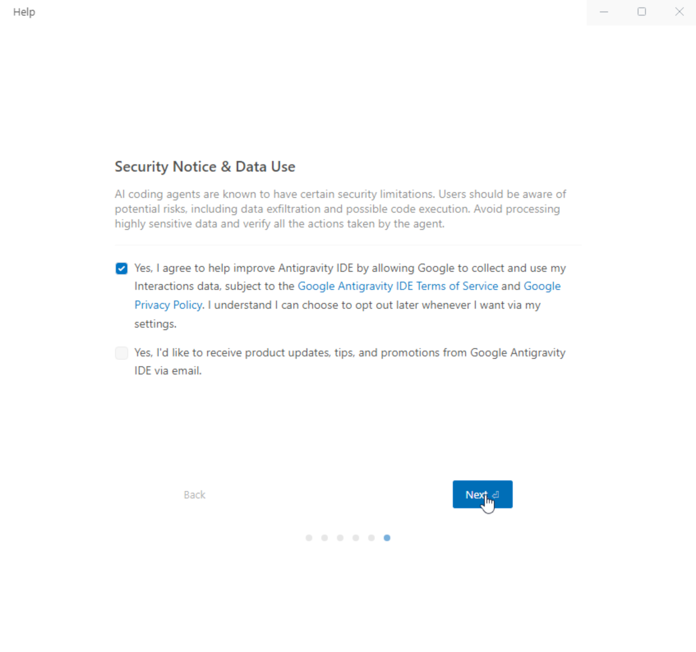
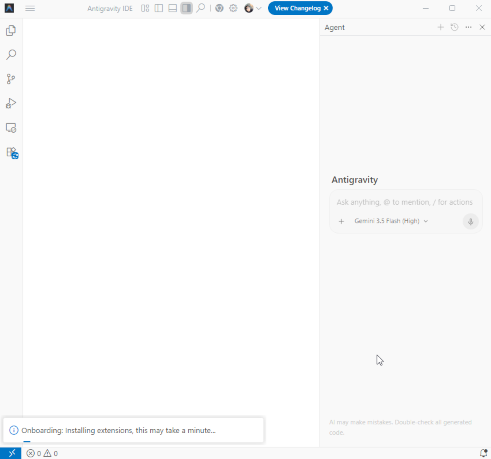
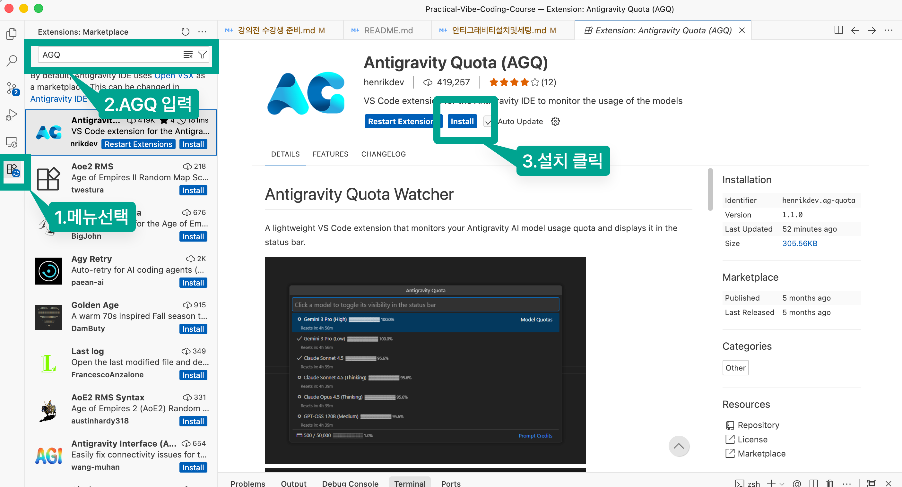

1. **[Google Antigravity 공식 웹사이트](https://antigravity.google/download)**에 접속하여 본인의 운영체제에 맞는 설치 프로그램(또는 익스텐션/바이너리)을 다운로드 후 설치 합니다.
[설치 및 세팅](안티그래비티설치및세팅.md)을 먼저 완료해 주시기 바랍니다.

## 1.Antigravity 설치

## 2. Antigravity 실행 

## 3. Antigravity 로그인 및 최초 설정  

- 구글 로그인 

- 로그인 완료 

- 테마 설정 

- 설정 

## 4. AGQ 설치   
